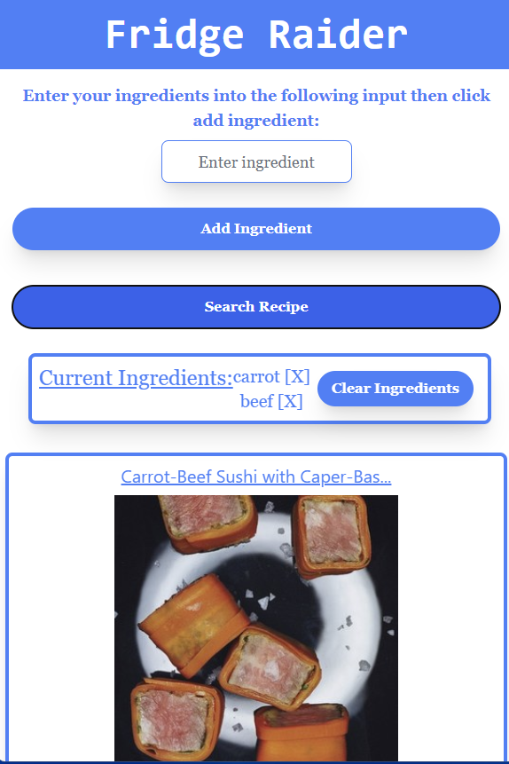

# recipe-finder
## Description
###
We created a website called Recipe Finder. When the user inputs an ingredient into the input and hits add ingredient, it gets saved into local storage and into the current ingredients list. Also the user is assisted with an autocomplete function from SpoonacularAPI. The user can then input more ingredients or hit search recipe. Once search Recipe is hit an api call to EdamamAPI occurs to retieve a recpie name, picture, and link to a recipe and those are displayed on cards below. Using the recipe name we also make a call to YoutubeAPI to fetch the most popular video for each recipe. We Have the option to save your favorite recipes in local storage and have them appear on a serperate page.
## Links
### 
[Website] https://natejmaster.github.io/recipe-finder/
[Repository] https://github.com/natejmaster/recipe-finder
## Screenshot
###

